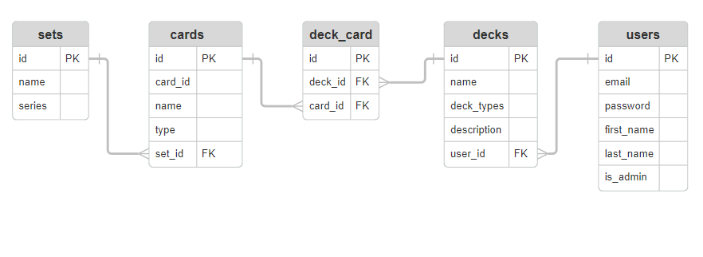

# T2A2 - API Webserver

## Coder Academy Term 2 Assignment 2

Student Name: Fabian Sugandhi\
[Github Repo](https://github.com/FabSugandhi/FabianSugandhi_T2A2)

## Installation and Running API Instructions

### Database Setup

1. Ensure that PostgreSQL, Python, and Pip are installed. Skip this step if you have them installed or refer to the following links for installation instructions:
    - [PostgreSQL Installation](https://www.postgresql.org/docs/current/tutorial-install.html)
    - [Python Installation](https://www.python.org/downloads/)
    - [Pip Installation](https://pip.pypa.io/en/stable/installation/)

2. Open a new terminal window. Navigate to __FabianSugandhi_T2A2/src__ directory in your terminal. Then, create a virtual environment with these commands:

    ```
    python3 -m venv venv
    ```
    
    Then activate it with:

    ```
    source venv/bin/activate
    ```

3. Next, install the dependencies using:

    ```
    pip install -r requirements.txt
    ```

4. Once the dependencies are installed, start PostgreSQL from your terminal.

    For WSL, in the terminal, start PostgreSQL with:

    ```
    sudo -u postgres psql
    ```

    For MacOS, in the terminal, start PostgreSQL with:

    ```
    psql postgres
    ```

5. With PostgreSQL, create a new database with this command:

    ```
    CREATE DATABASE <db_name>
    ```

    Replace the &lt;db_name&gt; with your choice of database name. For the purpose of this documentation, the database name is assumed to be __pokemontcg_db__.

6. Create a new __.flaskenv__ file in the __src__ directory and COPY and PASTE the code in the __.flaskenv.sample__ file into it, then you are free to adjust each field according to your configuration preferences.

7. Create a new __.env__ file in the __src__ directory and COPY and PASTE the code in the __.env.sample__ file into it, then you are free to adjust each field according to your configuration preferences.

8. Next, go back into your terminal and run the following commands to create and seed the tables in the database:

    ```
    flask db create
    ```

    ```
    flask db seed
    ```
    And run the following command to run the API client:
    ```
    flask run
    ```

9. Use your preferred API client to run and test the API. This project was tested using __Bruno__. You can install it from this [link](https://www.usebruno.com/downloads). Use localhost:<flask_run_port_value> in the URL. As an example, the testing of this API was performed using this address: _127.0.0.1:5000/_.

10. Go into the __blueprint__ directory and open each of the "__&lt;name&gt;-bp.py__" files within to find the available routes.

## R1: Explain the problem that this app will solve, and explain how this app solves or addresses the problem

While Pokemon TCG is one of the most popular Trading Card Game today, it is not without problems. As one of the biggest and one of the longest running name in the Trading Card Game scene, the Pokemon TCG has a very extensive card library, with cards of the same name sometimes having different versions coming from different sets. It is also becomes the game standard for the players to play multiple copies of some of the important cards in their decks. Also, some players prefer to not have to buy too many additional copies of specific cards, just because they want to be including them in multiple decks, rather just swapping them between the decks they are currently playing.

All these factors make it a very arduous task for the players to manually keep track of what cards they already have and which decks have they included each card to, something that might keep newer players away from exploring the game. This app is developed in order to alleviate some of those issues.

The purpose and main function of this app is to assist Pokemon TCG players trying to keep track of their card collections, as well as how many decks they have and which cards are included in each of their deck. By utilising this app, the players won't have to manually write each of their deck recipe on paper as usually done in the game's early days. Instead, they will be able to quickly and efficiently record their cards and decks into the app, with them always having the option to update their collections or adjust their deck recipes by utilising the app's functionalities. Additionally, the players also won't have to worry about inputting the wrong cards, since this application is seeded with the official list of legal cards and sets in the game's standard format. This means that as long as the player knows the name of the card and which set it comes from, the app automatically notes the information down for the player. This function helps the players remember which version of the card they already have or are playing in their deck when they are checking their decks recipes after they made them, which is very helpful when they have multiple decks and a larger card collection size.

This app will be designed so that it can be used flexibly in multiple platforms and by various users. For example, it can be utilised in a community website for Pokemon TCG players to share their collections, or maybe developed into an independent personal website for players who want to keep it simple and private.

## R2: Describe the way tasks are allocated and tracked in your project

### [GitHub Projects link](https://github.com/users/FabSugandhi/projects/3)

The tasks for this project were allocated and tracked using GitHub Projects. The tasks are categorized into cards which are arranged manually according to the order that they need to be created, as some are dependent on the others. They are then organized into the columns available on GitHub Project, namely __To Do__, __In Progress__ and __Done__. These are update as each task are started and finished. New tasks were also added in the appropriate order of priority whenever it was required to do so.

I decided to keep the due dates for each task to be flexible for this assignment since there will be a lot of back and forth between different tasks, even if they were completed correctly before due to the relational nature of this project. This is also to ensure that instead of sticking to a strict time schedule I should organize my working based on priorities and importance of the available tasks.

Git was also used to keep track of the version updates, with frequent git commits in order to safely backup the project and to be able to track my progress and review the progress of the assignment. It is also useful to get an outlook of the efficiency of working on this project and where can I improve my preformance.

Finally, the __Standup__ section in Coder Academy's Discord channel has proven very helpful to review my progress by setting other studnets' progress as the benchmark.I utilized this often to check whether I am behind or ahead of the expected project timeline. However, although this is an important aspect of this assignment, I didn't update my Standups often enough since I was too focused on catching up and finishing the assignment in time, especially since I had to to restructure my codes due to a fatal error which I can't pinpoint where.

### Screenshots


## R3: List and explain the third-party services, packages and dependencies used in this app

The full list of third-party services are available in the __requirements.txt__ file. This section will briefly explain about them.

### Flask

Flask is Python web framework that is used to create API web applications. Particularly, Flask is used to create the URL routes and for handling different HTTP requests. Since Flask is a microframework, it is structurally simple, scalable and supports various extensions which can be utilized to add more functionalities to the application (Pallets, 2010).

### SQLAlchemy

Imported into the application as Flask-SQLAlchemy. SQLAlchemy is used as a base for the application's Python SQL toolkit and Object Relational Mapper (ORM), which allows the usage of Python codes to perform SQL queries (Bayer & SQLAlchemy Contributors, n.d.). Flask-SQLAlchemy is the Flask extension that allows using SQLAlchemy functionalities in Flask. SQLAlchemy also allows Python's object-oriented programming features to be able to be used with SQL databases, such as using __model__ classes to represent tables and their records.

### Marshmallow

Imported into the application as Flask-Marshmallow. Marshmallow is an ORM, ODM (Object Document Mapper), or a framework-agnostic library that is used to convert complex data types to and from native Python data types (Loria & Contributors, 2023). Flask-Marshmallow is the Flask extension that allows using Marshmallow functionalities in Flask. Marshmallow allows the creation of schemas and data-format serialization (e.g. JSON from HTTP requests into Python, and vice versa). Marshmallow also has built-in functionalities which offer a robust way of executing operations that are traditionally more complex to perform and which are able to produce neater and more streamline error handling; example of these functionalities include data validation and nesting.

### Psycopg2

Psycopg2 is a PostgreSQL database adapter for Python. It is necessary in order to manage PostgreSQL databases using Python programming language, and thus connecting the Flask app with the database (Gregorio, Varrazzo & The Psycopg Team, 2021).

### Bcrypt

Imported into the application as Flask-Bcrypt. Bcrypt is an extension used to hash passwords as a data encryption method to ensure the passwords are secure (Countryman, 2011). Flask-Bcrypt is the Flask extension that allows using Bcrypt functionalities in Flask.

### JWT Manager

Imported into the application as Flask-JWT-Extended. JWT Manager is an extension used to manage JSON web tokens, which are used by the application for secure user authentication and verifying user identity in orger to grant them access to several functionalities that are exclusive to users of assigned authority (Gilbert, 2016). Flask-JWT-Extended is the Flask extension that allows using JWT Manager functionalities in Flask. This includes creating access tokens, protect routes, and getting identity of JWT tokens.

## R4: Explain the benefits and drawbacks of this app’s underlying database system

This application was developed using PostgreSQL as the database management system.

One reason for choosing this system is its robustness. PostgreSQL is an ACID (Atomicity, Consistency, Isolation, Durability) compliant Database Management Systems (DBMS), ensuring that all database transactions are processed reliably and prioritizing data integrity (Singh, 2023). Some example of its data integrity mechanism includes data types, triggers, and constraints. Furthermore, PostgreSQL's write-ahead logging minimizes the possibility of data loss (Peterson, 2024). Data integrity is a crucial aspect for systems like this collection tracker application, whose main purpose is to accurately manage and records data on each of its users' deck and card collections, in order to improve their quality of life by making it easy to find and retrieve the records. PostgreSQL also has useful features, such as constraints, that helps to ensure that each items are categorized and named accordingly, making search functionalities much more reliable for people trying to check specific cards.

Another reason for choosing PostgreSQL is its performance and scalability. PostgreSQL supports various performance optimization features, one such feature is unrestricted concurrency, which makes it efficient to run as the application's database grows (IBM, n.d).

PostgreSQL is also relatively easy to operate. Davidson argued that the features of PostgreSQL, such as the transactional Data Definition Language (DDL), allows users to perform multiple functions in a single transaction (e.g. dropping and creating tables) (Davidson, 2022). This is a very helpful feature for managing any complex relational applications, which will only be more apparent as the application's database grows. Additionally, PostgreSQL is a well-developed and widely adapted DBMS, having been developed since its inception as an open-source software by it large and active community. The size of its community shows PostgreSQL's reliability as one of the best DBMS to utilize for this project, with the extra assurance of having community support available should there be any problems arising further down the app's growth.

However, Kolovson argued that PostgreSQL has the tendency to be convoluted with too many "moving parts" because of its extensibilty, meaning that database made with PostgreSQL can be too complicated to set up or too convoluted to maintain over time, which is very apparent when PostgreSQL is implemented in embedded applications, for example (Kolovson, 2021). Panchenko also argues that the nature of PostgreSQL being developed on an open source environment means that users are sometimes required to research and weight between multiple choices of solutions when choosing what functionality do they want to include in their system, a provess which will required some degree of knowledge and expertise (Panchenko, 2021).

## R5: Explain the features, purpose and functionalities of the object-relational mapping system (ORM) used in this app

This application was developed using SQLAlchemy as the Object-Relational Mapping (ORM) system. ORM is a technique or layer that is used to bridge Object-Oriented Programs (OOP) and relational databases (Abba, 2022). SQL is used to perform operations such as create, reading, and deleting data from databases, otherwise known as CRUD (Create, Read, Update, Delete) operations. By using an ORM tool, such as the SQLAlchemy used for this app, SQL queries can be generated and performed using OOP languages (Python for this app) instead of manually writing the traditional complex SQL queries, greatly simplifying the code and making the development process more efficient (Abba, 2022).

SQLAlchemy functions by first mapping objects in the programming language and the tables in the database, which is done by developers defining the mapping between the different objects and fields and the columns in the databas in the app's native programming language (Kanade, 2023). These mappings will then be used to work on the database records as objects by interacting with them using object-oriented programming.

SQLAlchemy also use multiple strategies to map the tables and objects in the database. A few examples of these are achieved are by using active record (defining the structure of table and class pairing and mapping each class instance to the table's records), data mapper (separating the objects, such as the models, from the database layer), table gateway (structuring the app such that each table has a separate gateway through which the models access them), identity mapping (minimizing database queries by ensuring each instance corresponds to each object in the app), and unit of work (managing database transactions by defining which set of operations should be grouped as a single transaction) (Kanade, 2023).

SQLAlchemy also provides other functionalities, such as data validation using different constraints and field types, allowing relationships between tables in a relational database (such as one-to-one, one-to-many, etc.), and handling database schema modifications which can be achieved auto-generation of database schema based on changes made to the object mapping (Kanade, 2023).

## R6: Design an entity relationship diagram (ERD) for this app’s database, and explain how the relations between the diagrammed models will aid the database design



For the purpose of this application, a PostgreSQL database named pokemontcg_db is created. To design and implement their relationships with one another, 5 tables are created in the database. They are namely __users__, __decks__, __deck_cards__, __cards__, and __sets__. The interactions between the records in these 5 relations determine the main functionalities of the app.

### Users

User-related information are stored in the __users__ table. Each record in the table represents a registered user of the application, with information on their email, hashed password, name, admin rights, and their unique ID (the primary key). 

### Decks

Deck-related information are stored in the __decks__ table. Each record in the table represents a deck that a user has registered into the system, with information on their name, types, description, the user who made the post (using a __user_id__ foreign key) and their unique ID (the primary key). As a result, a __user__ can be associated with multiple __decks__, and a __deck__ can be associated with only one __user__.

## R7: Explain the implemented models and their relationships, including how the relationships aid the database implementation

NEED TO BE DONE

## R8: Explain how to use this application’s API endpoints

### Cards Blueprint

#### 1. /cards/

__HTTP Request__: GET

__Endpoint__: all_cards

__Required Data__: None

__Expected Response Data__: Expected return of JSON response with data on all cards on the database

__Authentication methods__: None

__Purpose__: Allows users to view all cards on the database

#### 2. /cards/< int:id >

__HTTP Request__: GET

__Endpoint__: one_card

__Required Data__: None

__Expected Response Data__: Expected return of JSON response with data of card with specified ID on the database

__Authentication methods__: None

__Purpose__: Allows users to view specific cards on the database

#### 3. /cards/

__HTTP Request__: POST

__Endpoint__: create_card

__Required Data__: card_id, name, type, set_id

__Expected Response Data__: Expected return of JSON response with data of the newly created card

__Authentication methods__: Admin only

__Purpose__: Allows admin users to add cards to the database

#### 4. /cards/< int:id >

__HTTP Request__: PUT or PATCH

__Endpoint__: update_card

__Required Data__: card_id, name, type, set_id

__Expected Response Data__: Expected return of JSON response with data of the updated card

__Authentication methods__: Admin only

__Purpose__: Allows admin users to update specific cards in the database

#### 5. /cards/< int:id >

__HTTP Request__: DELETE

__Endpoint__: delete_card

__Required Data__: None

__Expected Response Data__: Expected return of empty JSON response

__Authentication methods__: Admin only

__Purpose__: Allows admin users to delete specific cards in the database

### Deck_cards Blueprint

#### 1. /decks/< int:deck_id >/deck_cards/

__HTTP Request__: GET

__Endpoint__: all_deck_cards

__Required Data__: None

__Expected Response Data__: Expected return of JSON response with data on all cards of the specified deck ID in the database

__Authentication methods__: None

__Purpose__: Allows users to view all cards of the specified deck ID in the database

#### 2. /decks/< int:deck_id >/deck_cards/< int:id >

__HTTP Request__: GET

__Endpoint__: one_deck_card

__Required Data__: Noe

__Expected Response Data__: Expected return of JSON response with data of card with specified ID from the specified deck ID on the database

__Authentication methods__: None

__Purpose__: Allows users to view specific cards of the specified deck on the database

#### 3. /decks/< int:deck_id >/deck_cards/

__HTTP Request__: POST

__Endpoint__: create_deck_card

__Required Data__: a list of {deck_id, card_id} JSON array, multiple cards allowed

__Expected Response Data__: Expected return of JSON response with data of the newly created card in that deck ID

__Authentication methods__: Valid JWT Token, makes sure only owner of the deck can use the function

__Purpose__: Allows authorized users to add cards to the deck

### 4. /decks/< int:deck_id >/deck_cards/< int:id >

__HTTP Request__: PUT or PATCH

__Endpoint__: update_deck_card

__Required Data__: card_id

__Expected Response Data__: Expected return of JSON response with data of the updated card

__Authentication methods__: Valid JWT Token, makes sure only owner of the deck can use the function

__Purpose__: Allows authorized users to update specific cards in their deck

### 5. /decks/< int:deck_id >/deck_cards/< int:id >

__HTTP Request__: DELETE

__Endpoint__: delete_deck_card

__Required Data__: None

__Expected Response Data__: Expected return of empty JSON response

__Authentication methods__: Valid JWT Token, makes sure only owner of the deck can use the function

__Purpose__: Allows authorized users to delete specific cards from their deck

### Decks Blueprint

#### 1. /decks/

__HTTP Request__: GET

__Endpoint__: all_decks

__Required Data__: None

__Expected Response Data__: Expected return of JSON response with data on all decks on the database

__Authentication methods__: None

__Purpose__: Allows users to view all decks on the database

#### 2. /decks/< int:id >

__HTTP Request__: GET

__Endpoint__: one_deck

__Required Data__: None

__Expected Response Data__: Expected return of JSON response with data of deck with specified ID on the database

__Authentication methods__: None

__Purpose__: Allows users to view specific decks on the database

#### 3. /decks/

__HTTP Request__: POST

__Endpoint__: create_deck

__Required Data__: name, deck_types, description

__Expected Response Data__: Expected return of JSON response with data of the newly created deck

__Authentication methods__: Valid JWT Token, makes sure only owner of the deck can use the function

__Purpose__: Allows authorized users to add decks to the database

#### 4. /decks/< int:id >

__HTTP Request__: PUT or PATCH

__Endpoint__: update_deck

__Required Data__: name, deck_types, description

__Expected Response Data__: Expected return of JSON response with data of the updated deck
__Authentication methods__: Valid JWT Token, makes sure only owner of the deck can use the function

__Purpose__: Allows updated users to update specific decks in the database

#### 5. /decks/< int:id >

__HTTP Request__: DELETE

__Endpoint__: delete_deck

__Required Data__: None

__Expected Response Data__: Expected return of empty JSON response

__Authentication methods__: Valid JWT Token, makes sure only owner of the deck can use the function

__Purpose__: Allows authorized users to delete specific decks in the database

### Sets Blueprint

#### 1. /sets/

__HTTP Request__: GET

__Endpoint__: all_sets

__Required Data__: None

__Expected Response Data__: Expected return of JSON response with data on all sets on the database

__Authentication methods__: None

__Purpose__: Allows users to view all sets on the database

#### 2. /sets/< int:id >

__HTTP Request__: GET

__Endpoint__: one_set

__Required Data__: None

__Expected Response Data__: Expected return of JSON response with data of set with specified ID on the database

__Authentication methods__: None

__Purpose__: Allows users to view specific sets on the database

#### 3. /sets/

__HTTP Request__: POST

__Endpoint__: create_set

__Required Data__: name, series

__Expected Response Data__: Expected return of JSON response with data of the newly created set

__Authentication methods__: Admin only

__Purpose__: Allows admin users to add sets to the database

#### 4. /sets/< int:id >

__HTTP Request__: PUT or PATCH

__Endpoint__: update_set

__Required Data__: name, series

__Expected Response Data__: Expected return of JSON response with data of the updated set

__Authentication methods__: Admin only

__Purpose__: Allows admin users to update specific sets in the database

#### 5. /sets/< int:id >

__HTTP Request__: DELETE

__Endpoint__: delete_set

__Required Data__: None

__Expected Response Data__: Expected return of empty JSON response

__Authentication methods__: Admin only

__Purpose__: Allows admin users to delete specific sets in the database

### Users Blueprint

#### 1. /users/login

__HTTP Request__: POST

__Required Data__: email, password

__Expected Response Data__: Expected return of JSON response with the JWT token for authentication

__Authentication methods__: None

__Purpose__: Allows users to verify their credentials and generate a JWT token for authentication to access specific functions

#### 2. /users

__HTTP Request__: POST

__Required Data__: email, password, first_name, last_name, is_admin

__Expected Response Data__: Expected return of JSON response with data of newly created user

__Authentication methods__: Admin only

__Purpose__: Allows admin users to add users to the database

## Reference List

Abba, I. V. (2022). _What is an ORM: the meaning of object relational mapping database tools_. FreeCodeCamp. https://www.freecodecamp.org/news/what-is-an-orm-the-meaning-of-object-relational-mapping-database-tools/

Bayer, M., & SQLAlchemy Contributors. (n.d.). _SQL Alchemy: the Python SQL toolkit and object relational mapper_. https://www.sqlalchemy.org/

Countryman, M. (2011). _Flask-Bcrypt_. https://flask-bcrypt.readthedocs.io/en/1.0.1/#

Davidson, T. (2022). _Why use PostgreSQL for your next project?_. CleanCommit. https://cleancommit.io/blog/why-use-postgresql-for-your-next-project/

Gilbert, L. A. (2016). _Flask-JWT-Extended's documentation_. https://flask-jwt-extended.readthedocs.io/en/stable/

Gregorio, F. D., Varrazzo, D., & The Psycopg Team. (2021). _Psycopg - PostgreSQL database adapter for Python_. https://www.psycopg.org/docs/

IBM. (n.d.). _What is PostgreSQL?_. IBM. https://www.ibm.com/topics/postgresql

Kanade, V. (2023). _What is ORM? A comprehensive guide to object-relational mapping_. Spiceworks. https://www.spiceworks.com/tech/data-management/articles/what-is-orm-a-comprehensive-guide-to-object-relational-mapping/

Kolovson, C. (2021). _Weighing the pros and cons of PostgreSQL_. https://medium.com/@ckolovson/weighing-the-pros-and-cons-of-postgresql-5a3603dd34ce

Loria, S., & Contributors. (2023). _Marshmallow: simplified object serialization_. Marshmallow. https://marshmallow.readthedocs.io/en/stable/

Panchenko, I. (2021). _PostgreSQL benefits and challenges: a snapshop_. InfoWorld. https://www.infoworld.com/article/3619531/postgresql-benefits-and-challenges-a-snapshot.html

Pallets. (2010). _Flask_. https://flask.palletsprojects.com/en/3.0.x/

Peterson, R. (2024). _What is PostgreSQL? Introduction, advantages & disadvantages_. Guru99. https://www.guru99.com/introduction-postgresql.html

Singh, G. (2023). _The power of PostgreSQL: a comprehensive exploration_. Vertisystem. https://vertisystem.medium.com/the-power-of-postgresql-a-comprehensive-exploration-dba09e0e030c